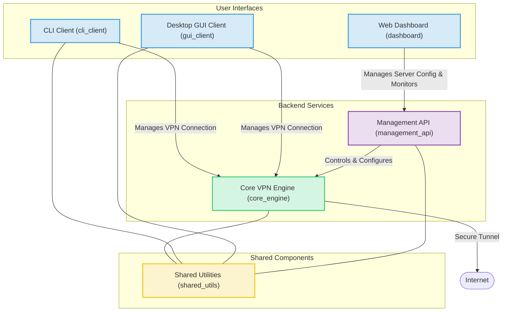

# CoentroVPN Architecture Diagram

## Diagram Legend and Explanation

*   **User Interfaces:**
    *   `CLI Client (cli_client)`: Command-line interface for users to connect to the VPN server and manage their connection.
    *   `Desktop GUI Client (gui_client)`: A graphical user interface for desktop users, providing similar functionality to the CLI client.
    *   `Web Dashboard (dashboard)`: A web-based interface for administrators to monitor server status, manage users (if applicable), and configure server settings. It interacts with the `Management API`.

*   **Backend Services:**
    *   `Core VPN Engine (core_engine)`: The central VPN server responsible for establishing and managing secure tunnels, routing traffic, and handling client connections.
    *   `Management API (management_api)`: An API service that provides endpoints for managing and configuring the `Core VPN Engine`. This is used by the `Web Dashboard`.

*   **Shared Components:**
    *   `Shared Utilities (shared_utils)`: A common library containing shared code, such as networking protocols, cryptographic functions, configuration handling, and logging, used by multiple components of the CoentroVPN system.

*   **Interactions:**
    *   CLI and GUI Clients connect directly to the `Core VPN Engine` to establish VPN sessions.
    *   The `Web Dashboard` communicates with the `Management API` to provide a user-friendly way to manage the VPN server.
    *   The `Management API` interacts with the `Core VPN Engine` to apply configurations and control its behavior.
    *   All major Rust components (`core_engine`, `cli_client`, `gui_client`, `management_api`) utilize the `shared_utils` library for common functionalities.
    *   The `Core VPN Engine` establishes a secure tunnel to the `Internet` for the connected clients.
